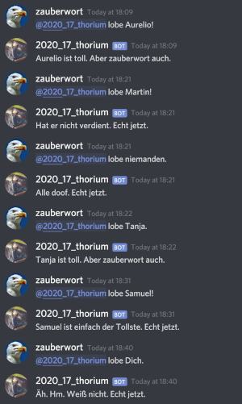

# Bot that praises

Yeah! 17th birthday!

## Install

  - Get .NET SDK, install additional packages `Discord.NET` and `Microsoft.Extensions.DependencyInjection`
  - Get a bot token end put it into the environment variable `DiscordToken`.
  - Authorize the bot for your server
  - Run it

## Sources

  - Discord.NET Documentation: https://docs.stillu.cc/index.html

  - Code Structure: https://docs.stillu.cc/guides/getting_started/samples/first-bot/structure.cs

   
